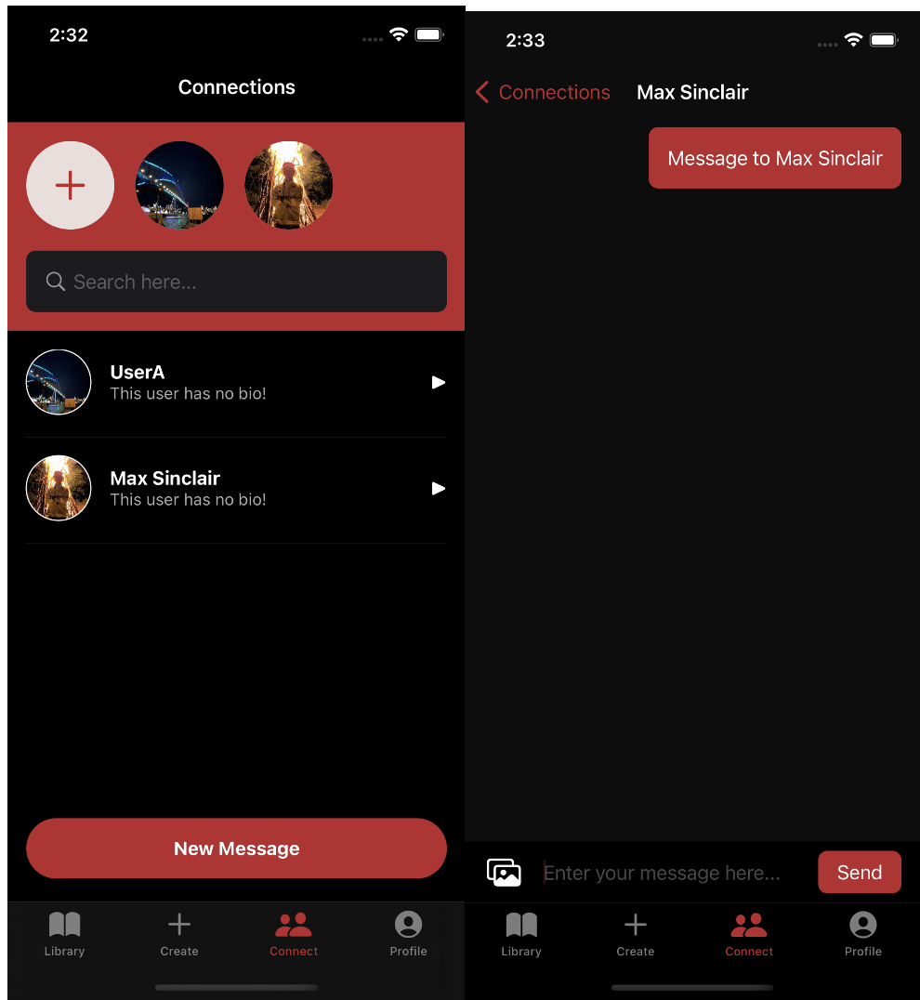

## Enable: Simple fitness app

Enable is an iOS app that allows users to create and manage exercises and routines and interact with others.

---

## 📱 Features

- **User Registration** – Apple/Google OAuth login support.
- **Create Exercises** – Add workouts with images, sets, and reps.
- **Build Routines** – Group multiple exercises into structured plans.
- **Public Profile Customization** – Customise your public profile for others to view.
- **Messaging Functionality** – Find and chat with other users.

---

## 📸 Screenshots

  
  
  
  

---

## 📋 Recommended system settings

- iPhone X or iPad Pro > **iOS 15 or later**

---

## 🛠 Self-deployment

Currently the app only supports self-deployment with Xcode on Mac devices:

### 1. Install Xcode

Download **Xcode 13 or later**.

> macOS is required to run Xcode and deploy iOS apps.

### 2. Open the Project

Unzip the project files and open the `.xcodeproj` file in Xcode.

### 3. Run the App

You can use:
- **Xcode Simulator** (recommended for testing) or a **real iOS device**

---

## 📝 License

This project is an **educational software project** developed in conjunction with **Enable Exercise** and is not intended for commercial distribution. For inquiries about use or collaboration, please contact the author.
